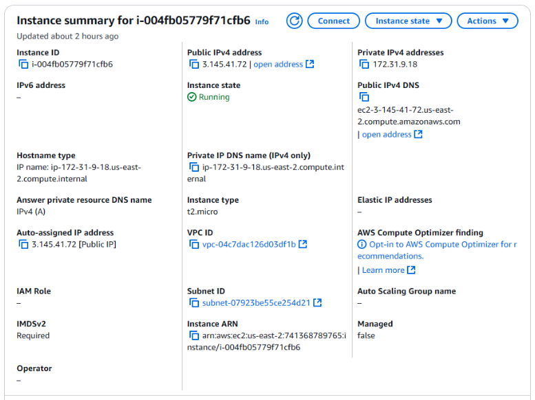
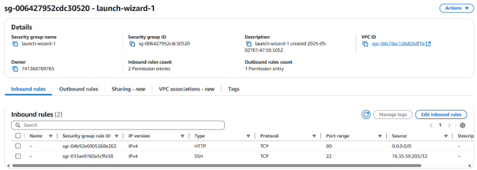
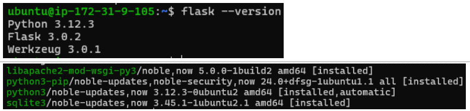

1. Launch an EC2 Instances

2. Configure a web server and SQLite3 database table

3. Share the code on GitHub: nam-k-nguyen/flask-app-aws

4. Public link for Instance: http://ec2-3-15-26-113.us-east-2.compute.amazonaws.com/